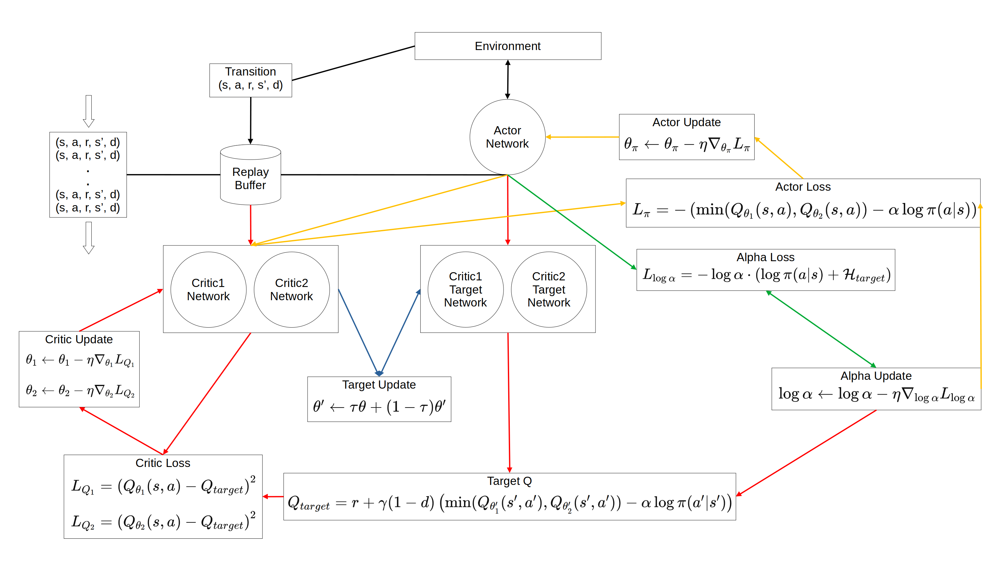

# Under-Construction

self.target_entropy = -action_dim

alpha_loss = -(self.log_alpha * (log_prob + self.target_entropy).detach()).mean()

log probabilities can be positive in continuous action spaces because they are computed from probability density functions rather than discrete probabilities. Because the log probabilities are summed over action dimensions in the neural network, the total log probability can readily exceed 16 when the target entropy is set to -16, which can cause alpha to increase. If the target entropy is set to plus sign, alpha increases even in situations where it should decrease, leading to excessively high randomness.

## Environment
### Unity
- Unity Editor: 6000.3.0f1
- ML Agents: 4.0.3
- Sentis: 2.6.1

### Python
- Python 3.10.12

## SAC Diagram

## Training Progress (SAC plot)

## Conclusion
